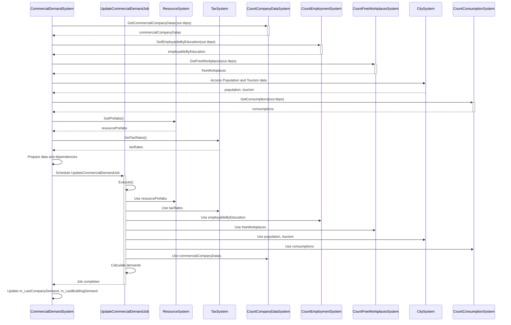
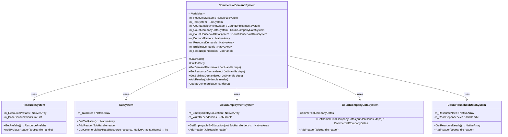
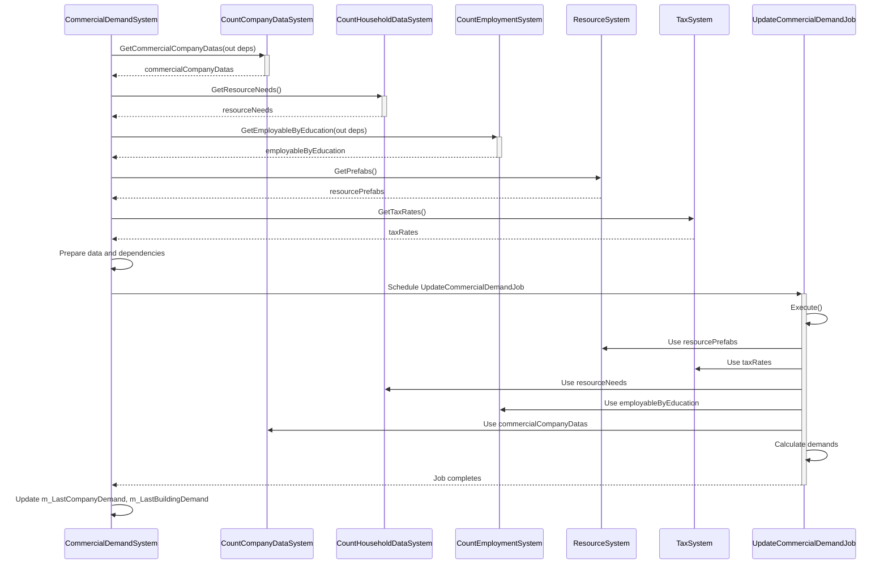

# CommercialDemandSystem Structure

## Version 1.1.4f1

### CommercialDemandSystem

#### OnCreate Function

In the `OnCreate()` method, the `CommercialDemandSystem` initializes references to several other systems that it depends on. These systems include:

- `ResourceSystem`
- `TaxSystem`
- `CountEmploymentSystem`
- `CountFreeWorkplacesSystem`
- `CitySystem`
- `CountConsumptionSystem`
- `CountCompanyDataSystem`

```csharp
protected override void OnCreate()
{
    base.OnCreate();
    this.m_ResourceSystem = this.World.GetOrCreateSystemManaged<ResourceSystem>();
    this.m_TaxSystem = this.World.GetOrCreateSystemManaged<TaxSystem>();
    this.m_CountEmploymentSystem = this.World.GetOrCreateSystemManaged<CountEmploymentSystem>();
    this.m_CountFreeWorkplacesSystem = this.World.GetOrCreateSystemManaged<CountFreeWorkplacesSystem>();
    this.m_CitySystem = this.World.GetOrCreateSystemManaged<CitySystem>();
    this.m_CountConsumptionSystem = this.World.GetOrCreateSystemManaged<CountConsumptionSystem>();
    this.m_CountCompanyDataSystem = this.World.GetOrCreateSystemManaged<CountCompanyDataSystem>();
    // Initialization of queries and native arrays...
}
```

#### Class Diagram

The CommercialDemandSystem depends on several other systems to perform its calculations. It uses data from:

- ResourceSystem
- TaxSystem
- CountEmploymentSystem
- CountFreeWorkplacesSystem
- CitySystem
- CountConsumptionSystem
- CountCompanyDataSystem

**Functions Used in the Listed Systems:**

- **ResourceSystem**
  - `GetPrefabs()`
  - `AddPrefabsReader(JobHandle handle)`
- **TaxSystem**
  - `GetTaxRates()`
  - `AddReader(JobHandle reader)`
- **CountEmploymentSystem**
  - `GetEmployableByEducation(out JobHandle deps)`
  - `AddReader(JobHandle reader)`
- **CountFreeWorkplacesSystem**
  - `GetFreeWorkplaces(out JobHandle deps)`
  - `AddReader(JobHandle reader)`
- **CitySystem**
  - Accesses `Population` and `Tourism` components
- **CountConsumptionSystem**
  - `GetConsumptions(out JobHandle deps)`
  - `AddConsumptionReader(JobHandle deps)`
- **CountCompanyDataSystem**
  - `GetCommercialCompanyDatas(out JobHandle deps)`
  - `AddReader(JobHandle reader)`

**Variables and Methods in `CommercialDemandSystem`:**

- **Public Methods:**
  - `OnCreate()`
  - `OnUpdate()`
  - `SetDefaults(Context context)`
  - `Serialize<TWriter>(TWriter writer)`
  - `Deserialize<TReader>(TReader reader)`
  - `GetDemandFactors(out JobHandle deps)`
  - `GetResourceDemands(out JobHandle deps)`
  - `GetBuildingDemands(out JobHandle deps)`
  - `GetConsumption(out JobHandle deps)`
  - `AddReader(JobHandle reader)`
- **Private Methods:**
  - `UpdateCommercialDemandJob (IJob)`
- **Variables:**
  - `m_ResourceSystem : ResourceSystem`
  - `m_TaxSystem : TaxSystem`
  - `m_CountEmploymentSystem : CountEmploymentSystem`
  - `m_CountFreeWorkplacesSystem : CountFreeWorkplacesSystem`
  - `m_CitySystem : CitySystem`
  - `m_CountConsumptionSystem : CountConsumptionSystem`
  - `m_CountCompanyDataSystem : CountCompanyDataSystem`
  - `m_DemandFactors : NativeArray<int>`
  - `m_ResourceDemands : NativeArray<int>`
  - `m_BuildingDemands : NativeArray<int>`
  - `m_Consumption : NativeArray<int>`
  - `m_FreeProperties : NativeArray<int>`
  - `m_WriteDependencies : JobHandle`
  - `m_ReadDependencies : JobHandle`
  - `m_LastCompanyDemand : int`
  - `m_LastBuildingDemand : int`

```mermaid
---
title CommercialDemandSystem
---
classDiagram
    class CommercialDemandSystem {
        +OnCreate()
        +OnUpdate()
        +SetDefaults(Context context)
        +Serialize<TWriter>(TWriter writer)
        +Deserialize<TReader>(TReader reader)
        +GetDemandFactors(out JobHandle deps)
        +GetResourceDemands(out JobHandle deps)
        +GetBuildingDemands(out JobHandle deps)
        +GetConsumption(out JobHandle deps)
        +AddReader(JobHandle reader)
        -UpdateCommercialDemandJob()
        -- Variables --
        -m_ResourceSystem
        -m_TaxSystem
        -m_CountEmploymentSystem
        -m_CountFreeWorkplacesSystem
        -m_CitySystem
        -m_CountConsumptionSystem
        -m_CountCompanyDataSystem
        -m_DemandFactors
        -m_ResourceDemands
        -m_BuildingDemands
        -m_Consumption
        -m_FreeProperties
        -m_WriteDependencies
        -m_ReadDependencies
        -m_LastCompanyDemand
        -m_LastBuildingDemand
    }
    class ResourceSystem {
        +GetPrefabs() : ResourcePrefabs
        +AddPrefabsReader(JobHandle handle)
        -m_ResourcePrefabs : NativeArray<Entity>
        -m_BaseConsumptionSum : int
    }
    class TaxSystem {
        +GetTaxRates() : NativeArray<int>
        +AddReader(JobHandle reader)
        +GetCommercialTaxRate(Resource resource, NativeArray<int> taxRates) : int
        -m_TaxRates : NativeArray<int>
    }
    class CountEmploymentSystem {
        +GetEmployableByEducation(out JobHandle deps) : NativeArray<int>
        +AddReader(JobHandle reader)
        -m_EmployableByEducation : NativeArray<int>
        -m_WriteDependencies : JobHandle
    }
    class CountFreeWorkplacesSystem {
        +GetFreeWorkplaces(out JobHandle deps) : NativeArray<int>
        +AddReader(JobHandle reader)
        -m_FreeWorkplaces : NativeArray<int>
        -m_WriteDependencies : JobHandle
    }
    class CitySystem {
        +City : Entity
        -Population : ComponentDataFromEntity<Population>
        -Tourism : ComponentDataFromEntity<Tourism>
    }
    class CountConsumptionSystem {
        +GetConsumptions(out JobHandle deps) : NativeArray<int>
        +AddConsumptionReader(JobHandle deps)
        -m_Consumptions : NativeArray<int>
        -m_CopyDeps : JobHandle
    }
    class CountCompanyDataSystem {
        +GetCommercialCompanyDatas(out JobHandle deps) : CommercialCompanyDatas
        +AddReader(JobHandle reader)
        -CommercialCompanyDatas
        -- Variables within CommercialCompanyDatas --
        -m_ProduceCapacity : NativeArray<int>
        -m_CurrentAvailables : NativeArray<int>
        -m_TotalAvailables : NativeArray<int>
        -m_TotalMaximums : NativeArray<int>
        -m_Companies : NativeArray<int>
        -m_Propertyless : NativeArray<int>
        -m_TotalMaxWorkers : NativeArray<int>
        -m_TotalCurrentWorkers : NativeArray<int>
        -m_WriteDependencies : JobHandle
    }

    CommercialDemandSystem --> ResourceSystem : uses
    CommercialDemandSystem --> TaxSystem : uses
    CommercialDemandSystem --> CountEmploymentSystem : uses
    CommercialDemandSystem --> CountFreeWorkplacesSystem : uses
    CommercialDemandSystem --> CitySystem : uses
    CommercialDemandSystem --> CountConsumptionSystem : uses
    CommercialDemandSystem --> CountCompanyDataSystem : uses
    CommercialDemandSystem ..> UpdateCommercialDemandJob : schedules

    class UpdateCommercialDemandJob {
        +Execute()
        -m_EconomyParameters : EconomyParameterData
        -m_DemandParameters : DemandParameterData
        -m_TaxRates : NativeArray<int>
        -m_ResourcePrefabs : ResourcePrefabs
        -m_EmployableByEducation : NativeArray<int>
        -m_FreeWorkplaces : NativeArray<int>
        -m_Population : Population
        -m_Tourism : Tourism
        -m_Consumptions : NativeArray<int>
        -m_Productions : NativeArray<int>
        -m_TotalAvailables : NativeArray<int>
        -m_TotalMaximums : NativeArray<int>
        -m_Companies : NativeArray<int>
        -m_Propertyless : NativeArray<int>
        -m_TotalMaxWorkers : NativeArray<int>
        -m_TotalCurrentWorkers : NativeArray<int>
        // Additional variables...
    }
    UpdateCommercialDemandJob ..> ResourceSystem : uses GetPrefabs()
    UpdateCommercialDemandJob ..> TaxSystem : uses GetTaxRates()
    UpdateCommercialDemandJob ..> CountEmploymentSystem : uses m_EmployableByEducation
    UpdateCommercialDemandJob ..> CountFreeWorkplacesSystem : uses m_FreeWorkplaces
    UpdateCommercialDemandJob ..> CitySystem : uses Population, Tourism
    UpdateCommercialDemandJob ..> CountConsumptionSystem : uses m_Consumptions
    UpdateCommercialDemandJob ..> CountCompanyDataSystem : uses CommercialCompanyDatas
```



#### Sequence Diagram

During the `OnUpdate()` method:

1. `CommercialDemandSystem` calls `CountCompanyDataSystem.GetCommercialCompanyDatas(out deps)` to retrieve commercial company data.
2. It calls `CountEmploymentSystem.GetEmployableByEducation(out deps)` to obtain employment data.
3. It calls `CountFreeWorkplacesSystem.GetFreeWorkplaces(out deps)` to get free workplace information.
4. It accesses `Population` and `Tourism` components from `CitySystem`.
5. It calls `CountConsumptionSystem.GetConsumptions(out deps)` to acquire consumption data.
6. It calls `ResourceSystem.GetPrefabs()` to get resource prefabs.
7. It calls `TaxSystem.GetTaxRates()` to retrieve tax rates.
8. It sets up data for `UpdateCommercialDemandJob`, including fetching required data and dependencies.
9. It runs `UpdateCommercialDemandJob`, which uses the collected data to calculate the commercial demands.



### Additional Details

- The `UpdateCommercialDemandJob` iterates over each resource and calculates the demand based on factors such as employment rates, consumption levels, tax rates, available properties, and current production levels.
- The job uses methods like `TaxSystem.GetCommercialTaxRate()` to obtain tax rates for calculations.
- Data from `CitySystem`, specifically `Population` and `Tourism`, is used to adjust demand based on city demographics.
- The calculated demands are stored in the `m_DemandFactors`, `m_ResourceDemands`, and `m_BuildingDemands` arrays for use by other systems or the UI.

## Version 1.1.5f1

### CommercialDemandSystem

#### OnCreate Function

In the `OnCreate()` method, the `CommercialDemandSystem` initializes references to several systems it depends on. These systems include:

- `ResourceSystem`
- `TaxSystem`
- `CountEmploymentSystem`
- `CountCompanyDataSystem`
- `CountHouseholdDataSystem`

```csharp
protected override void OnCreate()
{
    base.OnCreate();
    this.m_ResourceSystem = this.World.GetOrCreateSystemManaged<ResourceSystem>();
    this.m_TaxSystem = this.World.GetOrCreateSystemManaged<TaxSystem>();
    this.m_CountEmploymentSystem = this.World.GetOrCreateSystemManaged<CountEmploymentSystem>();
    this.m_CountCompanyDataSystem = this.World.GetOrCreateSystemManaged<CountCompanyDataSystem>();
    this.m_CountHouseholdDataSystem = this.World.GetOrCreateSystemManaged<CountHouseholdDataSystem>();
    // Initialization of queries and native arrays...
}
```

#### Class Diagram

In this version, CommercialDemandSystem uses CountHouseholdDataSystem instead of CountConsumptionSystem, CountFreeWorkplacesSystem, and CitySystem. This reflects the shift to using household data directly for demand calculations.



#### Sequence Diagram

During the OnUpdate() method:

1. CommercialDemandSystem retrieves commercial company data from CountCompanyDataSystem.
2. It obtains resource needs directly from CountHouseholdDataSystem.
3. It gets employment data from CountEmploymentSystem.
4. It acquires resource prefabs from ResourceSystem.
5. It retrieves tax rates from TaxSystem.
6. It runs the UpdateCommercialDemandJob, using the data to calculate the commercial demands based on household needs.



### Additional Details

- The `UpdateCommercialDemandJob` now uses household resource needs from `CountHouseholdDataSystem` instead of consumption data from `CountConsumptionSystem`.
- The job no longer relies on `CitySystem` for population and tourism data, as this information is now derived from household data.
- The demand calculation process has been simplified and now focuses more on household needs rather than city-wide consumption.

### CountCompanyDataSystem

#### Updates in Version 1.1.5f1

- **Functions Used by `CommercialDemandSystem`:**
  - `GetCommercialCompanyDatas(out JobHandle deps) : CommercialCompanyDatas`
- **Additional Variables in `CommercialCompanyDatas`:**
  - `m_CurrentAvailables : NativeArray<int>`
  - `m_ProduceCapacity : NativeArray<int>`
  - `m_ServiceCompanies : NativeArray<int>`
  - `m_ServicePropertyless : NativeArray<int>`
  - `m_TotalAvailables : NativeArray<int>`
  - `m_CurrentServiceWorkers : NativeArray<int>`
  - `m_MaxServiceWorkers : NativeArray<int>`

### CountEmploymentSystem

#### Updates in Version 1.1.5f1

- Employment data now uses `int2` instead of `int`, representing both "moved-in" and "total" counts.
- **Methods Used:**
  - `GetEmployableByEducation(out JobHandle deps) : NativeArray<int2>`
- **Variables:**
  - `m_EmployableByEducation : NativeArray<int2>`
  - `m_UnemploymentByEducation : NativeArray<int2>`
  - `m_Unemployment : NativeValue<int2>`
  - `m_PotentialWorkersByEducation : NativeArray<int2>`

### TaxSystem

#### Updates in Version 1.1.5f1

- The `TaxSystem` now includes potential adjustments for "moved-in" and "total" counts, similar to `CountEmploymentSystem`.
- **Functions Used by `CommercialDemandSystem`:**
  - `GetTaxRates() : NativeArray<int>`
  - `GetCommercialTaxRate(Resource resource, NativeArray<int> taxRates) : int`
